# ROB12 - TP 1

## Code Structure

For a better understanding and code organization the code provided by the professors to the TP was cutted in 3 smaller parts. 

```
kalman.py
simulation.py
EKFLocalization.py

seed.py (just for global seed setup) 
```

### kalman.py

This section of code contains the **Kalman Filter** it self. It contains then the model functions such as :

```python
def motion_model(x, u, dt_pred):
    # x: estimated state (x, y, heading)
    # u: control input or odometry measurement in body frame (Vx, Vy, angular rate)
    # dt_pred: time step
    
    # returns the angular integration of x and u using tcomp function

def observation_model(xVeh, iFeature, Map):
    # xVeh: vecule state
    # iFeature: observed amer index
    # Map: map of all amers

    # returns the observation model (slide 29)

def get_obs_jac(xPred, iFeature, Map):
    # xPred: predicted state
    # iFeature: observed amer index
    # Map: map of all amers
    
    # return observation jacobian (slide 29)
    
def F(x, u, dt_pred):
    # x: estimated state (x, y, heading)
    # u: control input (Vx, Vy, angular rate)
    # dt_pred: time step
    
    # returns the prediction model matrix F (slide 28)

def G(x, u, dt_pred):
    # x: estimated state (x, y, heading) in ground frame
    # u: control input (Vx, Vy, angular rate) in robot frame
    # dt_pred: time step for prediction

    # returns the linearization of model control/noise (calculated by hand)

    theta = x[2, 0]
    s = np.sin(theta)
    c = np.cos(theta)
    
    df_du = np.array([
        [c*dt_pred, -s*dt_pred,0],
        [s*dt_pred, c*dt_pred, 0],
        [0, 0,  dt_pred]
    ])

    return df_du

```

### simulation.py

**Simulation** models the robot by generating control inputs, updating the true position, simulating noisy odometry for the EKF, and providing occasional noisy landmark measurements.


```python
class Simulation:        
    def get_robot_control(self, k):
        # generate  sin trajectory
        return np.array([[0, 0.025,  0.1*np.pi / 180 * sin(3*np.pi * k / self.nSteps)]]).T
        
    def simulate_world(self, k):
        # updates true position

    def get_odometry(self, k):
        # simulates the robot's noisy motion by propagating the odometry state with the control input and then adding Gaussian noise from QTrue, returning both the updated noisy state and noisy control, which is what the EKF uses instead of the true state.

    def get_observation(self, k):
        # the robot sometimes gets a measurement of a random landmark. That measurement is noisy, and sometimes it may not exist at all (depending on timing and validity conditions).
```

### EKFLocalization.py

This is the main program. It is responsible for using the other files to implement the Extended Kalman Filter algorithm for mobile robot localization, simulating robot motion with odometry and landmark observations. This program is also responsible for configurating all simulation parameters and ploting the simulation into a nice screen. It tracks errors and covariance, and visualizes trajectories, 3σ bounds, and covariance evolution in real time, supporting distance, direction, or combined sensor modes.

```python
simulation = sim.Simulation(Tf, dt_pred, xTrue, QTrue, xOdom, Map, RTrue, dt_meas)

# Temporal loop
for k in range(1, simulation.nSteps):

    # Simulate robot motion
    simulation.simulate_world(k)

    # Get odometry measurements
    xOdom, u_tilde = simulation.get_odometry(k)

    # Kalman prediction

    Fk = F(xEst, u_tilde, dt_pred)
    Gk = G(xEst, u_tilde, dt_pred)

    xPred = motion_model(xEst,u_tilde,dt_pred)
    PPred = Fk @ PEst @ Fk.T + Gk @ QEst @ Gk.T

    # Get random landmark observation
    [z, iFeature] = simulation.get_observation(k)

    if z is not None:
        # Predict observation
        zPred = observation_model(xPred, iFeature, Map)
        H = get_obs_jac(xPred, iFeature, Map)
        
        if SENSOR_MODE == 'distance+direction':
            # compute Kalman gain - with dir and distance
            Innov = z - zPred # observation error (innovation)
            Innov[1, 0] = angle_wrap(Innov[1, 0])
            
            S = H @ PPred @ H.T + REst 

        elif SENSOR_MODE == 'distance':
            # Compute Kalman gain to use only distance
            Innov = z[0:1, :] - zPred[0:1, :]
            H = H[0:1, :]
            S = H @ PPred @ H.T + REst[0:1, 0:1]
            
        elif SENSOR_MODE == 'direction':
            # Compute Kalman gain to use only direction
            Innov = z[1:2, :] - zPred[1:2, :]
            Innov[0, 0] = angle_wrap(Innov[0, 0])
            H = H[1:2, :]
            S = H @ PPred @ H.T + REst[1:2, 1:2]
        else:
            print("Invalid SENSOR_MODE")
        
        K = PPred @ H.T @ np.linalg.inv(S)

        # perform kalman update
        xEst =  xPred + K @ Innov
        xEst[2, 0] = angle_wrap(xEst[2, 0])

        PEst = (np.eye(3) - K @ H) @PPred
        PEst = 0.5 * (PEst + PEst.T)  # ensure symetry

    else:
        # there was no observation available
        xEst = xPred
        PEst = PPred
```
## Experiments

In the following subsections some experiments will be conducted in order to get a better understanding and intuition on how important each paramenter is and how well can this EKF can perform under non ideal conditions. 

The code provided was a bit modified so that the plots will also inform the state of the parameters under study: 

- Landmark count
- Delta time between measurements
- Available sensors (distance/direction/both)
- Odometry noise/precision
- Sensor noise/precision

Also, I added the trace of P plot so that we can see the general converging.

I used the *save* parameter to generate the intermediare figures and then made animated GIFs

### Baseline

This first experiment shows that the filter is actually working. In green we can see what the odometry alone would estimate, beeing completelly blinded from the landmarks measurements. There we can see that from the first seconds it has already a poor estimation, completelly diverging from the actual positioning.

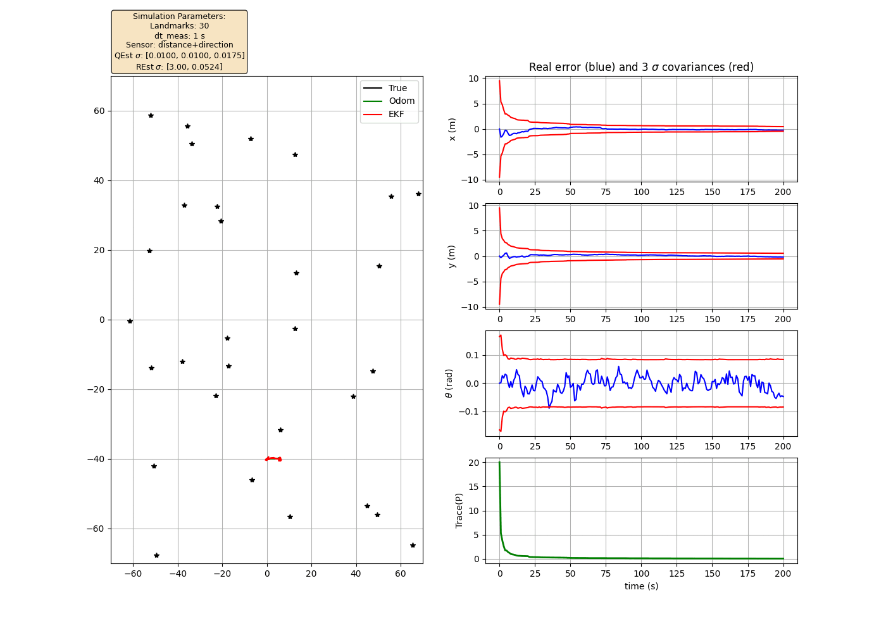

### Trou de measures

In this experiment we are simulating what happens if the landmarking sensoring stop suddenly [from time 2500s up to 3500s]. It is impressive how fast the algorithm fixes the new odometry error, showing that it in fact a roboust method.


### Sensor measurment interval

In a similar way of the experiment above, we can investigate how the algorithm performs when this "trou de measures" happens more frequently. Until the last experiment all simulation was happening with pose prediction and landmark measuring with the same frequency. Increasing this ratio, we can simulate 1 landmark measurement for every 5s and 50s.

| 5s | 50s |
| --- | --- |
| 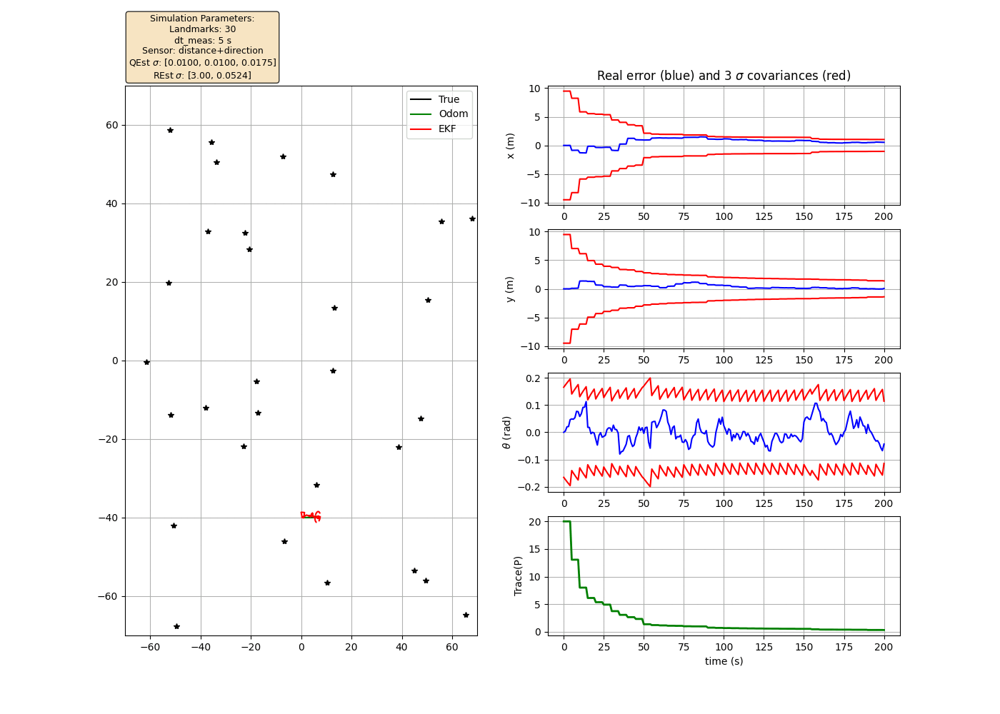 | 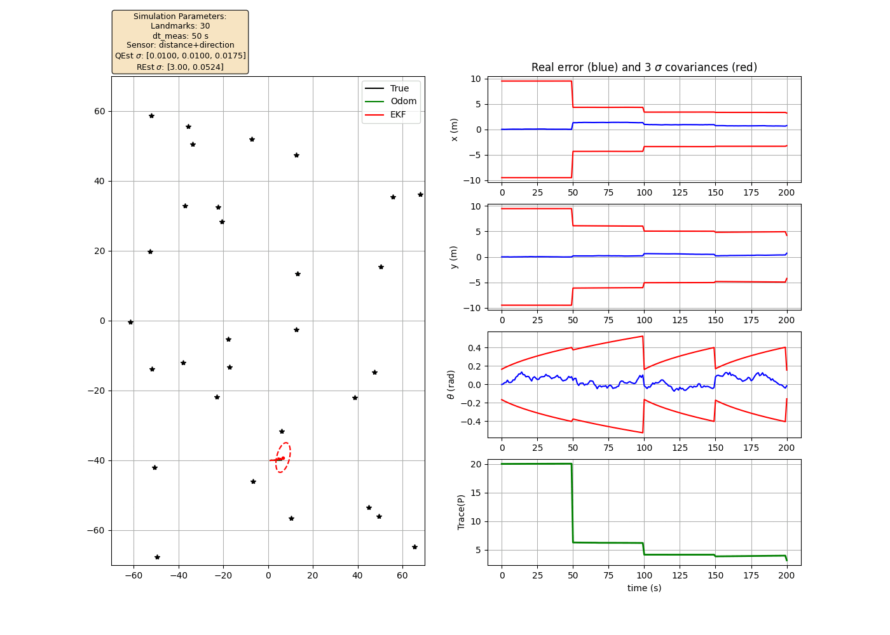 |

We can see a similar behaviour to the last experiment where when there is no landmark we end up having to trust the odometry blindly. However, as it is for a small amount of time the filter is indeed able to quickly "reset" the error. 

Is is also possible to see that the $3\sigma$ confiance interval grows. It is clearer to confirm it by checking the trace(P) plot. The 5s interval "converges" much quicker than the "50s"

### Landmarks

In this section we are going to use our baseline experiment to verify if there is a minimum amount of landmarks where beyond this limit adding more landmarks doesn't apport big bennefits.

| $N = 1$ | $N = 2$ |
| --- | --- |
|  | 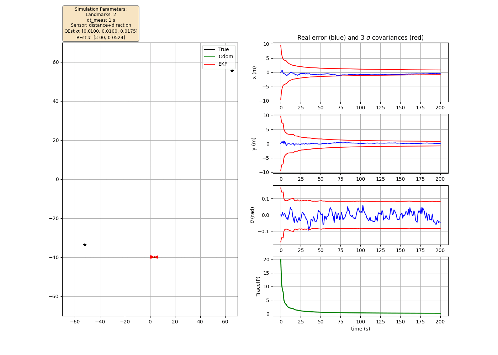 |

| $N = 3$ | $N = 300$ |
| --- | --- |
|  |  |

From these four plots, we can see that there is a huge impact when going from N=1 to N=2. Adding a third doesn't seem to have much effect anymore, and by N=300 it's clear that increasing the number of landmarks makes almost no difference.

We are noting this result and later on this document we'll verify if N=2 is still this "limit" where the performance impacts stops.

### QEst Noise

The QEst represents the covariance of errors used for the robot odometry. Therefore in the baseline experiment its value was $[0.01, 0.01, \pi/180]$.
It is then the error associated with the x-axis, y-axis and direction.

Some experiments were conducted in order to visualize how important those parameters are for the EFK performance. Worse odometries forces the filter to relie on the landmark sensoring and vice-versa. 

The figures on the left has a worse odometry than the baseline and better on the right. We start by checking the X-axis and Y-axis precision, then we'll move to direction analysis.

| $\sigma_x$ and $\sigma_y$ $\times 10$ | $\sigma_x$ and $\sigma_y$ $/ 10$ |
| --- | --- |
| 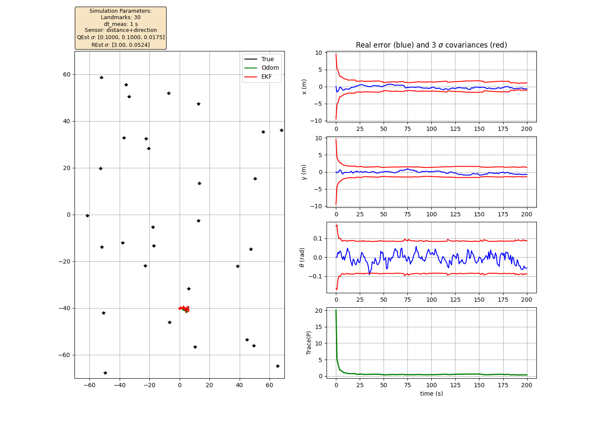 | 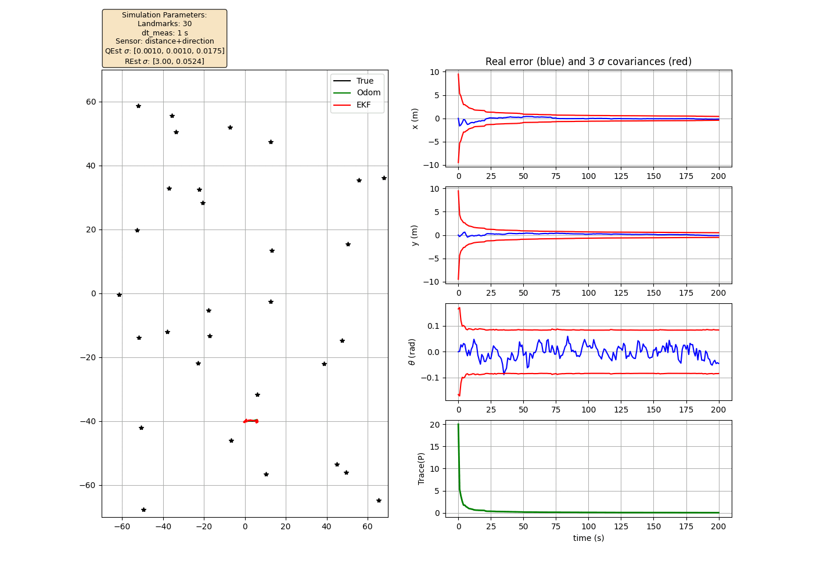|

| $\sigma_\theta\times 10$ | $\sigma_\theta/10$ |
| --- | --- |
| 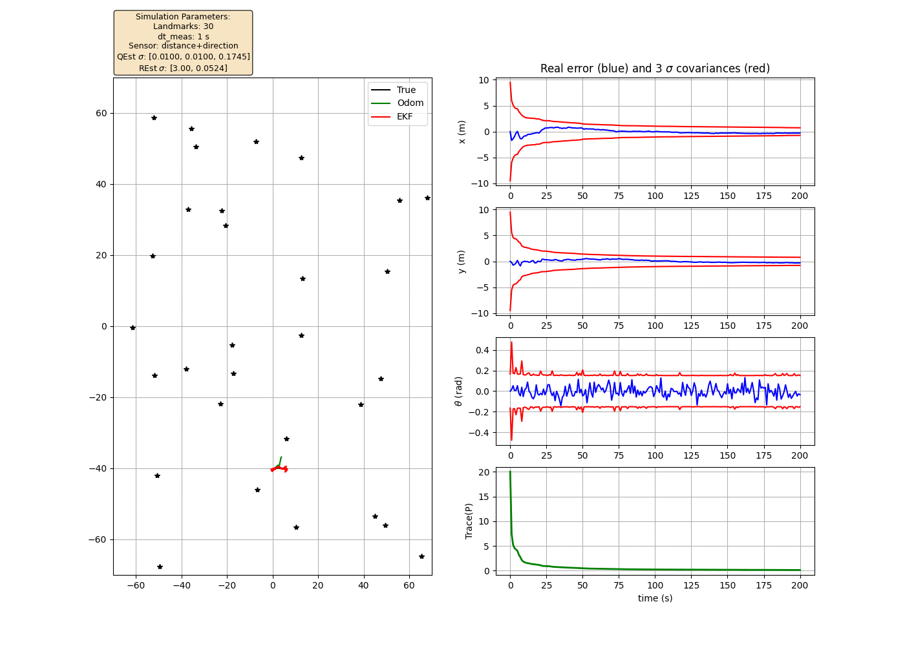 |  |

By analysing the figures above we can that the performace gain atributed to the direction odometry is brutal. Both x and y odomtries seems to play a imporant role in local prediction, we can see the trajectorie becomes much smoother. However, for a better final position estimation the direction estimation is crucial. As the original odometry already has a smooth movement it seems that Kalman is already trusting the local prediction to the robots local odometry which seems to make sense once that our X and Y precision has and ordem of $10^{-2}$ m (centimeters). We'll better explore this on the next experiments, we'll make the distance sensor worse and it won't affect to much ni the smoothness ni the overall EKF estimation.

### REst Noise

This section we'll be analysing what happens when we increase and decrease each sensor's precision.

The following figures compare our baseline with the improved sensor configurations. As mentioned earlier, we suspect that the local odometry was already “good enough,” providing a smooth trajectory. When we improved the distance sensor precision by a factor of ten, the X and Y position estimates showed reduced uncertainty. However, this higher precision did not significantly improve direction estimation, which was already relatively low in error. Later in this document, we will analyze the behavior of each sensor in isolation to further investigate this hypothesis.

| Baseline | $\sigma_{distance}/10$ |
| --- | --- |
|  | 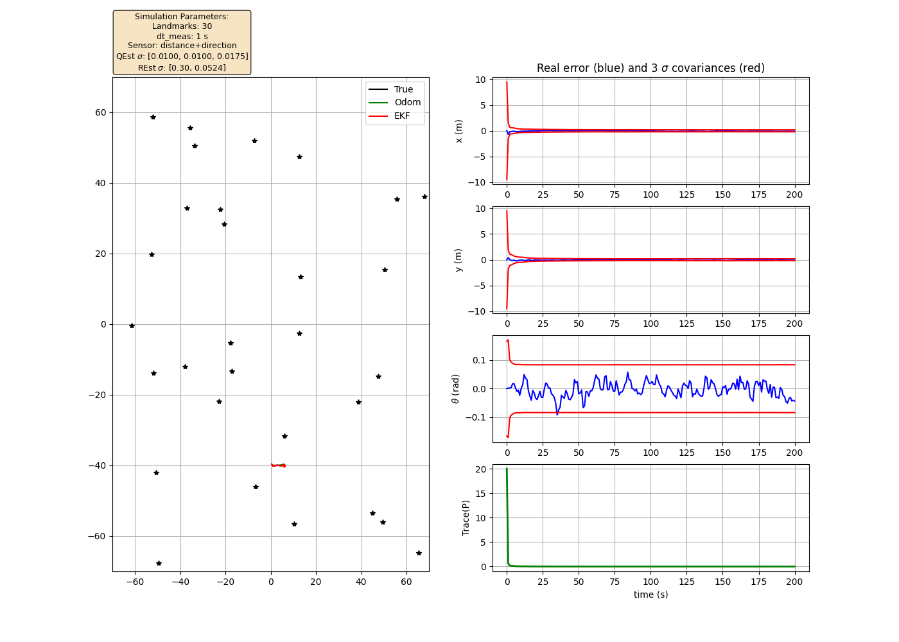 |

In the following figures we can see that improving our direction sensor really clamps our already high precision direction estimation. It also improoved the X and Y precisions as we can see on the plot by having a thinner gap of the red lines on X and Y plots, demonstrating its essential role.

| Baseline | $\sigma_{direction}/10$ |
| --- | --- |
|  | 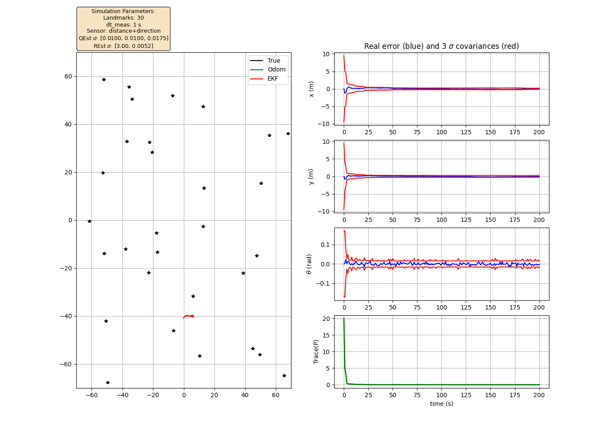 |


In the following figures we are comparing worse sensors to better sensors relative to our baseline by a factor of ten. Once again the direction sensoring seems to be the one promoting the greatest benefits.

| $\sigma_{distance}\times10$ | $\sigma_{distance}/10$ | 
| --- | --- |
|  |  |

| $\sigma_{direction}\times10$ | $\sigma_{direction}/10$ | 
| --- | --- |
| 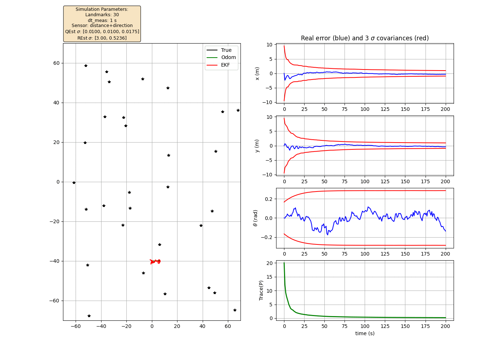 |  |

Overall comparison for both precisions compared to the baseline

| $\sigma_{distance}$ and $\sigma_{direction}\times10$ | Baseline | $\sigma_{distance}$ and $\sigma_{direction}/10$ | 
| --- | --- | --- |
| 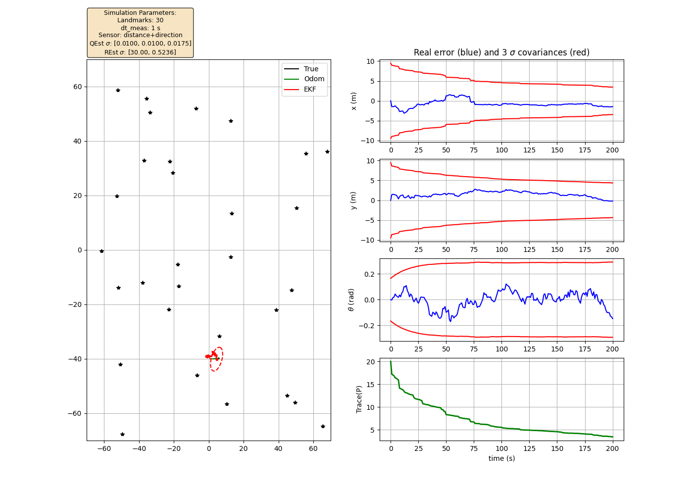 |  | 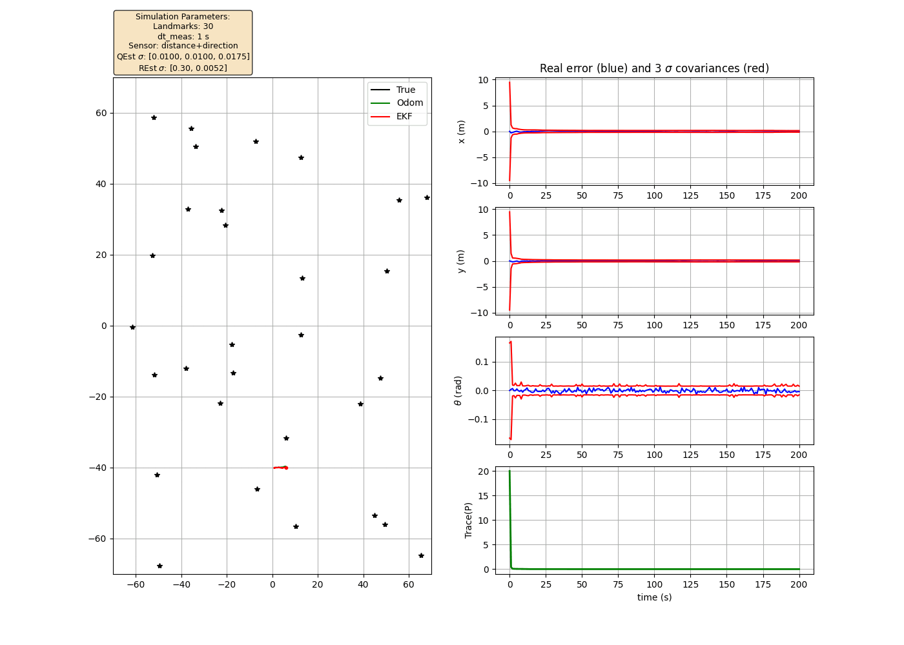 |

### Sensor Isolation Investigation

For this part of the study we'll be investigating how each sensor alone performs on the absence of the other. We'll also search how important QEst and REst becomes in each scenario.  

The following figures compares the performance of only having one of the sensors at a time. It clearly shows that the direction sensoring play a mojor role to the kalman filter overall performance. Having the direction estimation not only drastically reduces the angular pose uncertanty but also ameliorates the X and Y positions, making the estimated trajectory much smoother and precise. 

| No Direction *(range-only)* | No Distance *(direction-only)*|
| --- | --- |
| 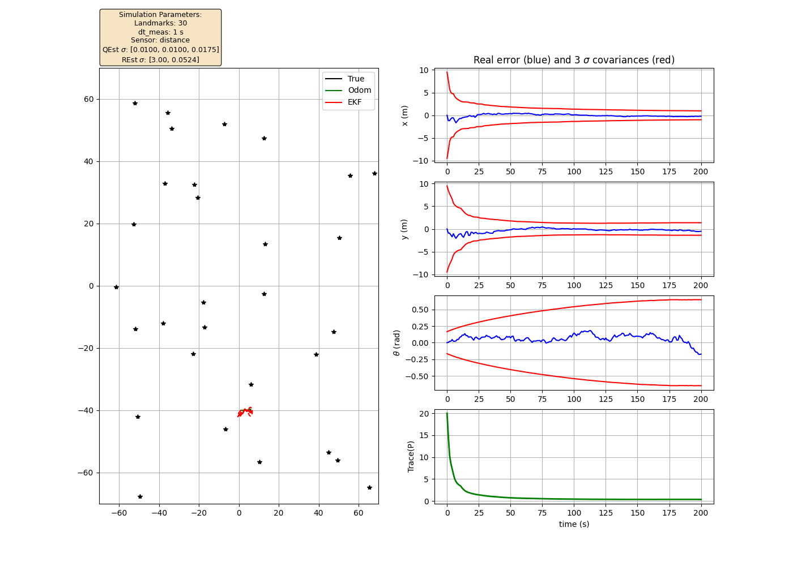 |  |

### Range Only

In this section we are analysing how EKF performs based only in odometry and landmarks' **distances**.

#### QEst tunning

In order to the EFK to have more or less the same performance as the original baseline it is clear that we should improve the direction estimation or odometry.
Our baseline had a $3\sigma = 0.1$, to achieve this again it was clear that we needed to drastically reduce the odometry direction uncertainty.

Setting $\sigma_\theta$ to $0.08\times\pi/180$ = $0.08\degree$ got us to the following overall results.


| Baseline | $\sigma_\theta = 0.08\degree$  |
| --- | --- |
|  | 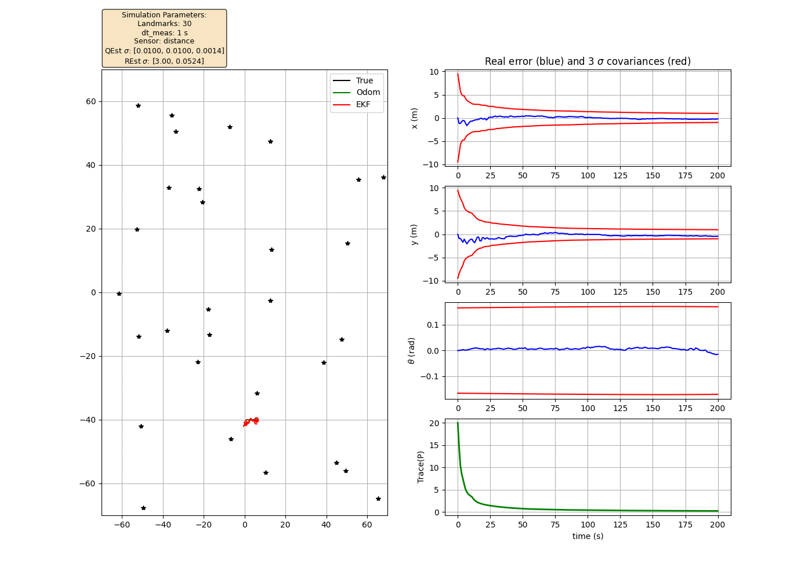 |

#### REst tunning

The direction odometrie had to improved by a factor of 12.5 and still wasn't able to make the x and y metrics to come down. The uncertainty of the distance sensor also had to go down, reinforcing the importance of that sensor.

| Baseline | $\sigma_\theta = 0.08\degree$ and $\sigma_{distance} = 2$  |
| --- | --- |
|  | 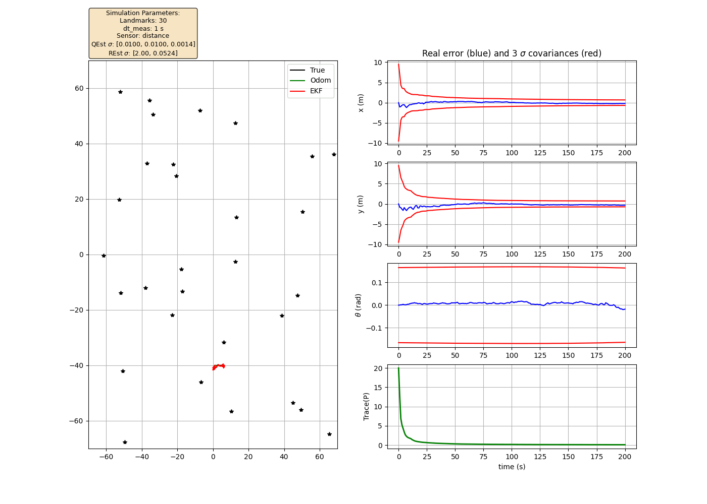 |

#### Landmarks 

The following test will vary the landmarks count. Our objective is to verify if only 2 landmarks are still enough for a good EKF performance as it was verified above on the dual sensor setup.

| Landmarks = 1 | Landmarks = 2 |
| --- | --- |
| 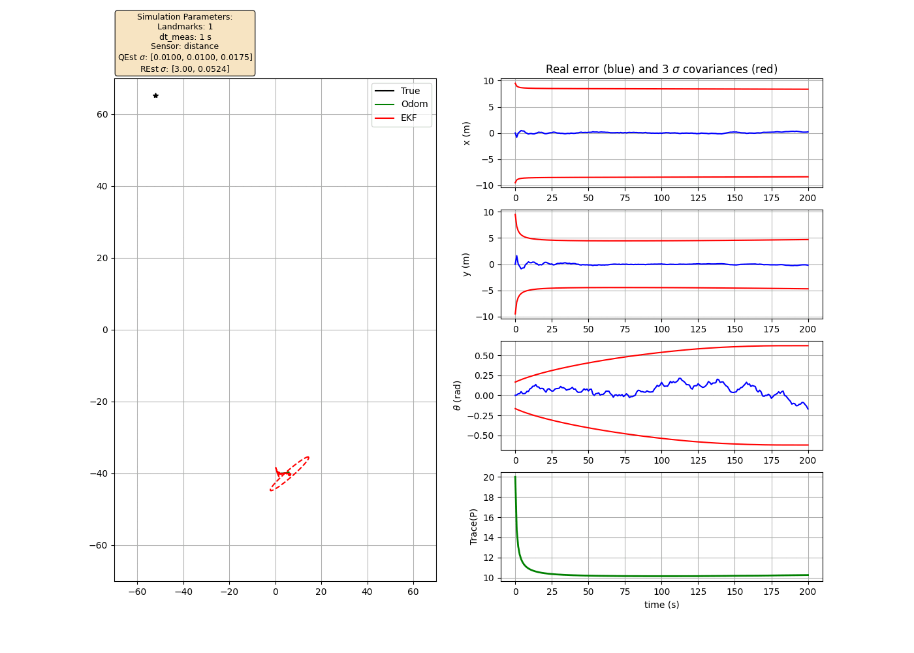 | 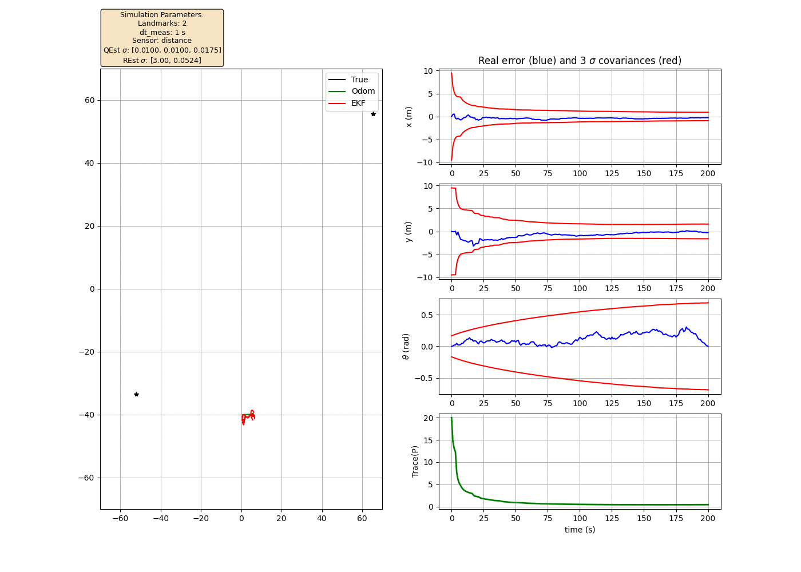 |

| Landmarks = 3 | Landmarks = 30 |
| --- | --- |
| 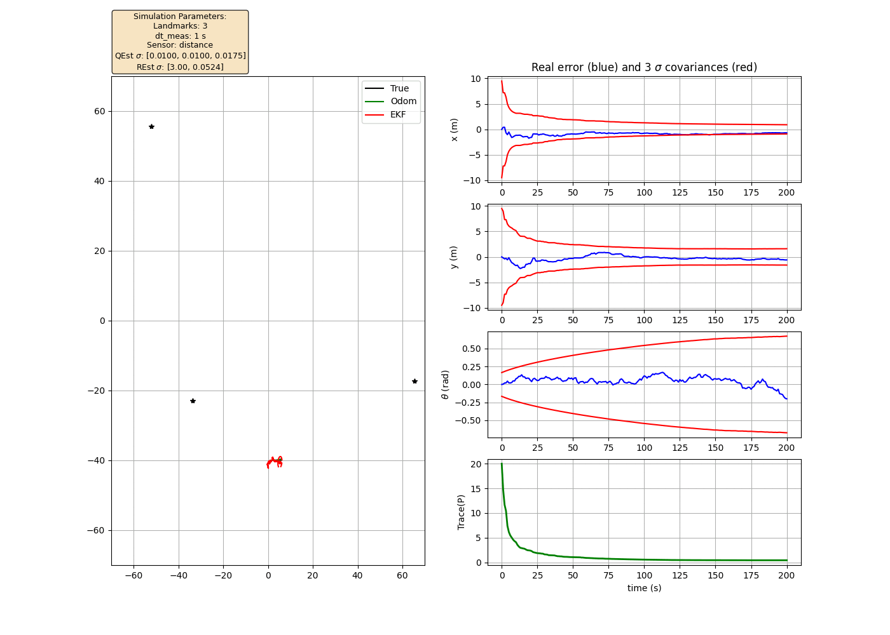 |  |

Now it is a bit clearer that N=2 might be unstable in some cases for the range-only sensoring. Now N=3 seems to be the "limit", which is still no much and makes sense accordingly to the triangularization problem, where to accurately estimate a position you must have at least 3 points of reference.


### Direction Only

In this section we are analysing how EKF performs based only in odometry and landmarks' **directions**.

| Baseline | Direction-Only Baseline |
| --- | --- |
|  |  |

By observing the figures above we can see that by removing distance to the landmarks sensors our trajectory has almost the same performance.

#### QEst tunning

For this section lets test how much we can worse our odometrie and still obtain similar results to the baseline. As we are not calculating distances and we already had the insight that X and Y were beeing more estimated by our odometrie lets try to mess the direction odometrie and see up to which point only the sensoring can mitigate the problems.

I tried multiple values for $\sigma_\theta$ and made it five times more uncertain and I was still able to achive satifastory results.

| $\sigma_{\theta} = 5\degree$ |
|  --- |
| 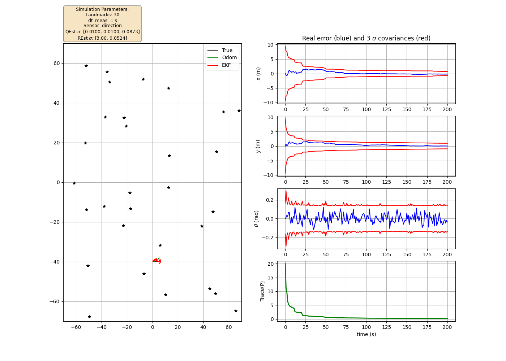 |

| $\sigma_{\theta} = 10\degree$ | $\sigma_{\theta} = 22.5\degree$ |
| --- | --- |
| 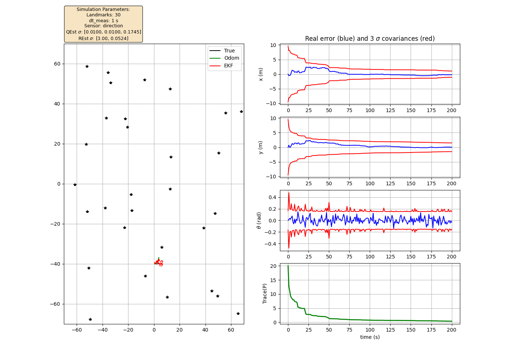 | 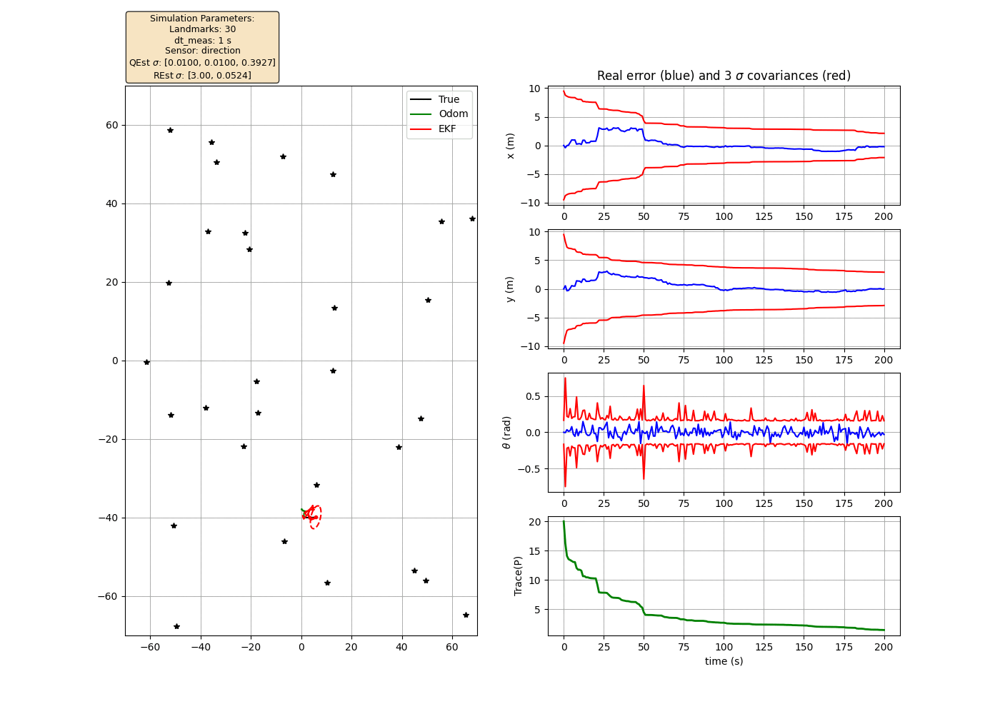 |

Even after drastically increasing the $\sigma_{\theta}$ the overall performance remained stable and close to baseline performance. This should not happen if we increase $\sigma_{x}$ and $\sigma_{y}$, that because we already noticed that the precision on x and y axis are atributed to the nice position odometry the robot already had.

The following image shows two scenarios the odometry noise 10x higher than original baseline.
The left one has both sensors and the right has only direction sensor.

It is clear that both have equivalent performance showing once again that the distance sensor is not really doing much in improving our EKF pose estimation. The Kalman gain is and was certainly relling bascially only in x, y odometry.

| (Both sensors) $\sigma_x$ and $\sigma_y$ $\times 10$  | (Direction Only) $\sigma_{x}$ , $\sigma_{y}$ $\times10$ |
|  --- | --- |
|  | 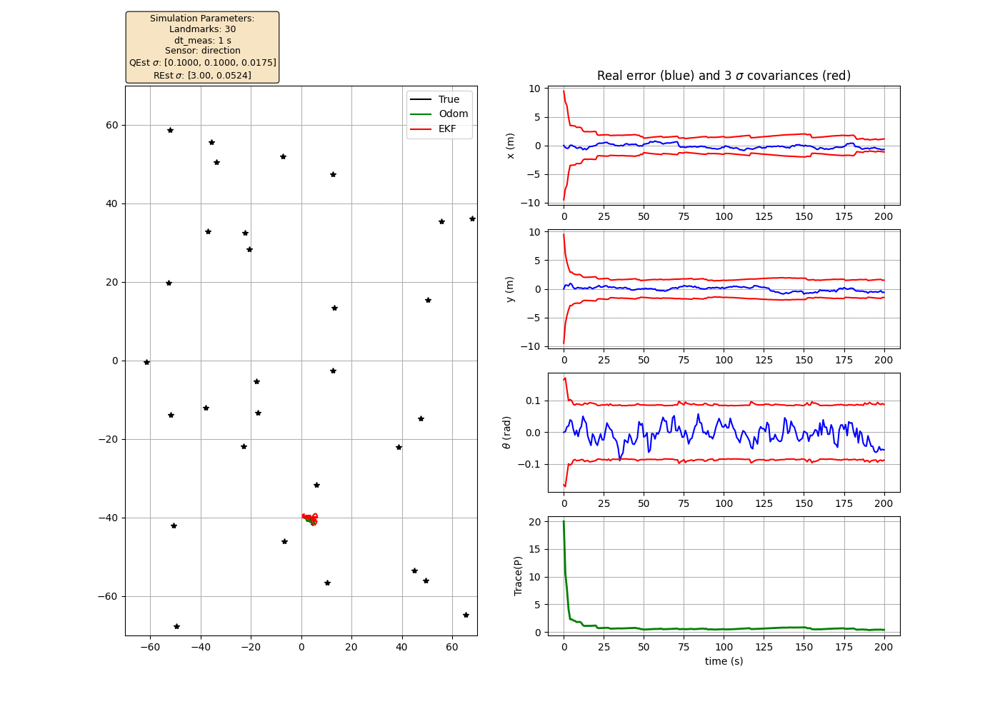 |

#### REst tunning

#### Landmarks

| Landmarks = 1 | Landmarks = 2 |
| --- | --- |
| 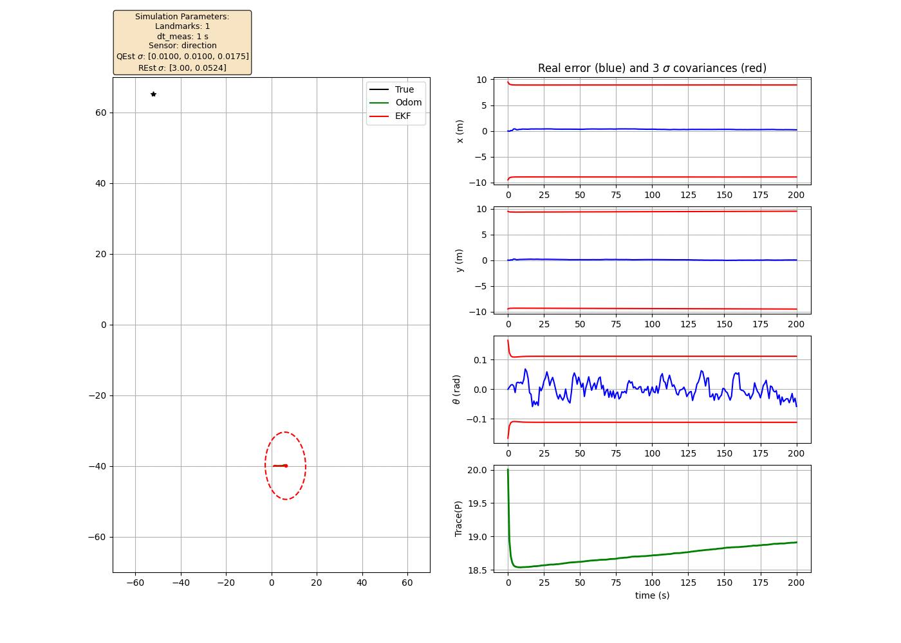 |  |

| Landmarks = 3 | Landmarks = 30 |
| --- | --- |
| 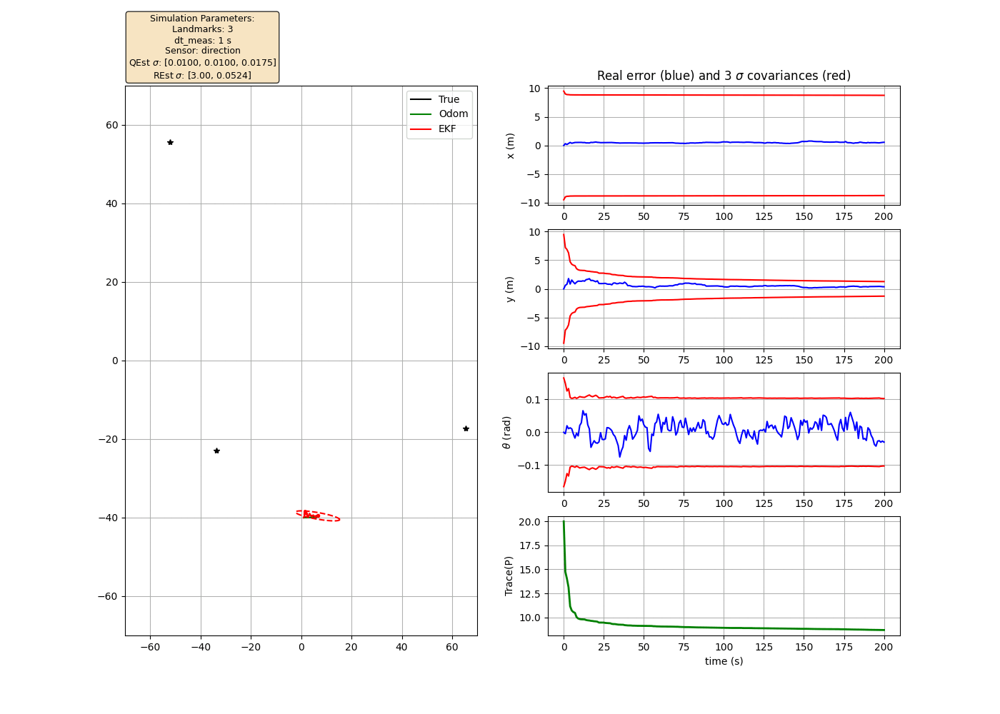 |  |